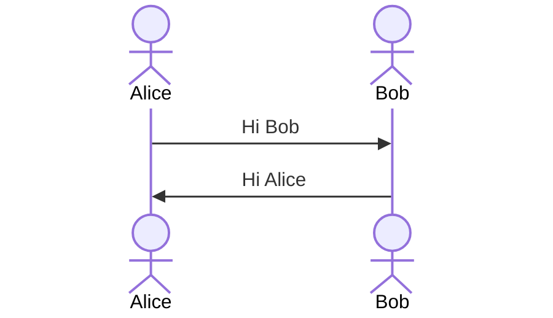

# IE322_GUI_Atif
## Created by Dr. Atif
### IE322
clone this repository to learn about the stuff covered about **C#** during *IE322 class*.

Following topics are covered.
<!--Ordered List -->

1. first item
2. second item


### CS code block

<!-- JS Block -->

```javascript
function add(num1, num2)
{

}

```


<details>
    <summary>Click to see more!</summary>
    
    ## More awesome tips!

    - item 1 
    - item 2
   </details>

## Class Diagram
   ```mermaid
classDiagram
    class Animal {
        +name: string
        +age: int
        +makeSound(): void
    }

    class Dog {
        +breed: string
        +bark(): void
    }

    class Cat {
        +color: string
        +meow(): void
    }

    Animal <|-- Dog
    Animal <|-- Cat
```

## Sequence Diagram

